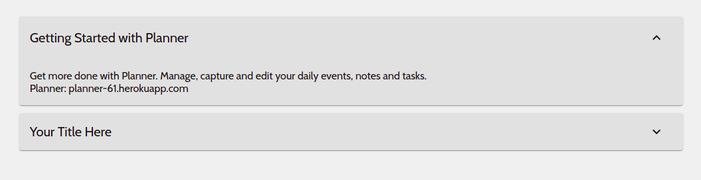

# Accordian

This project is a basic Accordian component.
<br />
It can be used further in any react project.

## Getting Started

To use Accordian in your project copy the Accordian folder in your React Project and import the Accordian component

```js
import Accordian from "./Accordian/Accordian.jsx";
```

To use the Accordian component

```html
<Accordian />
```

-   **Note**: Make Sure you have included Google Material Icons import in your $public/index.html$ file
    <br />
    If not copy and paste it inside <code>&lt;head&gt;</code> in your file

```html
<link
	rel="stylesheet"
	href="https://fonts.googleapis.com/css?family=Roboto:300,400,500,700&display=swap"
/>
<link
	href="https://fonts.googleapis.com/icon?family=Material+Icons"
	rel="stylesheet"
/>
```

## Props

-   **summary** - JSX/string: for Accordian summary/title

-   **details** - JSX/string: for Accordian content/details

-   **defaultExpanded** - boolean: true/false to expand/collapse the Accordian on component mount

## Examples

-   **Simple Accordian**

```html
<Accordian />
```

-   **Simple Accordian with custom values**

```html
<Accordian summary="Title Here" details="Content Here" />
```

-   **Advanced Accordian with JSX**

```html
<Accordian
	summary={<div className="title">Getting Started with Planner</div>}
	details={
		<div className="content">
			Get more done with Planner. Manage, capture and edit your daily
			events, notes and tasks.
			<div>
				<a href="https://planner-61.herokuapp.com">
					Planner: planner-61.herokuapp.com
				</a>
			</div>
		</div>
	}
	defaultExpanded
/>
```

## Styles

The color and transition time are declared in Accordian.css file

```css
:root {
	--accordian-bgcolor: #e1e1e1;
	--accordian-transition-time: 200ms;
}
```

Stylesheet can further be customized as per convinience (not recommended)

## Screenshots

<p align="center">

</p>

## Author

[Akshat Mittal](https://github.com/akshatmittal61)
